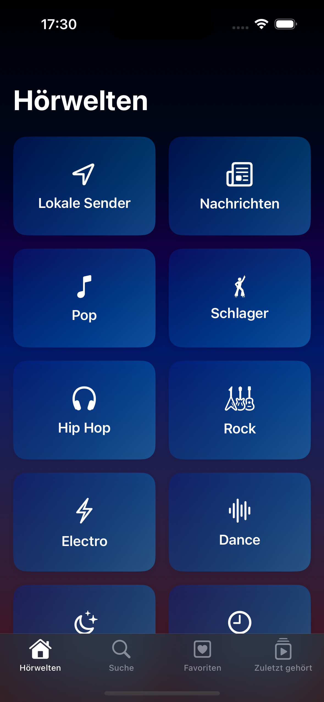
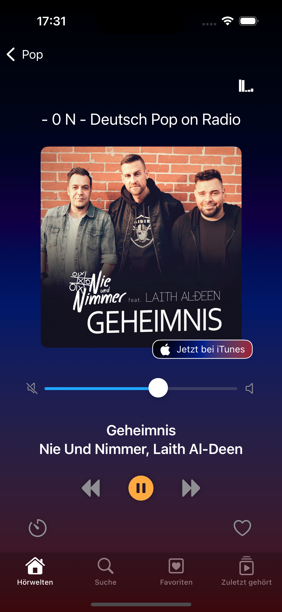
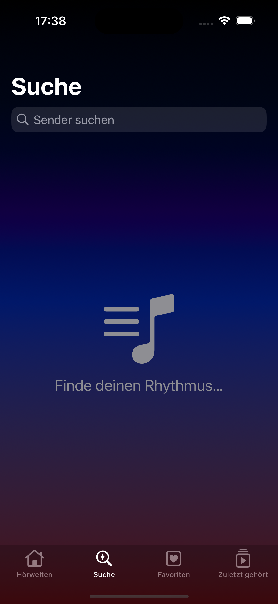

# Radio Sphere

**Radio Sphere** is an iOS application that lets users explore and listen to thousands of international radio stations.

## Features

- Access to thousands of global radio streams via the [Radio-Browser API](https://www.radio-browser.info/)
- Search and filtering options
- Display of song titles, artists, and album artwork using the iTunes Search API and MusicBrainz
- Built-in sleep timer
- Favorites and listening history
- SwiftUI-based navigation
- No collection of personal data

## Technology Stack

- SwiftUI & Combine
- FRadioPlayer (HTTP audio streaming)
- Radio-Browser API, iTunes Search API, MusicBrainz API
- Xcode 16.3 +, iOS 16.6 +

## Screenshots

| Home | Player | Search |
|------|--------|--------|
|  |  |  |

## Privacy

Radio Sphere does **not** collect or store any personally identifiable information. All network requests are limited to retrieving publicly available metadata.

## Project Status

**Working prototype**  
Radio Sphere is being developed as part of a Bachelor’s thesis and is currently distributed via TestFlight. An App Store release is planned.

## Contact
beatrix.bauer@gmail.com

Questions or feedback?  
Your Name • your.email@example.com
